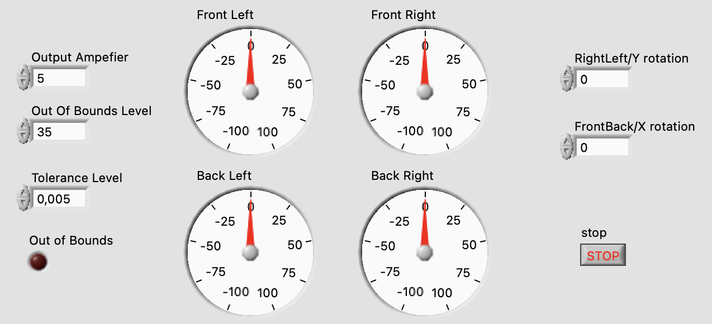

# Capjet-Orientation-Control-System Documentation

## Overview

The **Capjet-Orientation-Control-System** is designed to maintain the orientation of the ROV in a stable and stationary position underwater. The system uses gyroscopic feedback to monitor the ROV’s rotational speeds in both the **RightLeft/Y** and **FrontBack/X** axes. Once activated, the system compensates for any unintentional movements by adjusting thrusters in real-time, ensuring that the ROV remains still, even in the presence of external forces like currents.

### Flowchart Representation

The following flowchart illustrates the logical flow of the **Capjet-Orientation-Control-System**:

1. The system starts by checking the gyroscope for any rotational movement.
2. If the detected orientation is within an acceptable range (based on the **Tolerance Level**), no action is taken.
3. If the detected rotation is beyond the acceptable difference but within the safe range, a compensating effect is output to each thruster to correct the orientation.
4. If the detected orientation exceeds the **Out of Bounds** level, the system stops automatically.
5. The system can also be stopped manually at any point.

---

## Inputs

- **Gyroscope Rotations**: The inputs represent the rotational speed of the system in **degrees per second** using two axes of rotation:
  - **RightLeft/Y Rotation**: Monitors the rotation along the Y-axis (left to right movement of the ROV).
  - **FrontBack/X Rotation**: Monitors the rotation along the X-axis (back to front movement of the ROV).

For testing purposes, manual input controls are provided to simulate gyroscope readings for the X (FrontBack) and Y (RightLeft) axes. This allows the operator to observe how the system responds under various rotation speeds without requiring an actual gyroscope.

## Outputs

- **Thruster Signals**: The outputs consist of four signals, each controlling one of the ROV's thrusters:
  - Front Left Thruster.
  - Front Right Thruster.
  - Back Left Thruster.
  - Back Right Thruster.

These signals are represented by the Thruster Gauges on the front panel, displaying real-time adjustments based on the rotational feedback from the gyroscope. The outputs can be connected directly to the respective thrusters, providing precise corrective actions to maintain the ROV's stability.

### Threshold Parameters

- **Tolerance Level**: This parameter accounts for natural noise in the underwater environment, such as sensor inaccuracies. The system ignores any rotational speed within this range, preventing unnecessary thruster adjustments and ensuring that it only responds to significant rotational changes.
- **Out of Bounds Level**: This parameter defines the maximum safe rotational speed for the ROV. If the detected speed exceeds this limit, the system halts operations to prevent damage or instability. The threshold is usually set high enough to account for extreme external forces or malfunctions.
- **Output Amplifier**: This parameter amplifies the corrective output signals sent to the thrusters. It allows the system to fine-tune the thruster response based on the degree of detected rotation.

---

## Front Panel Elements

The following image shows the LabVIEW Front Panel for controlling the system:

### Controls

- **RightLeft/Y Rotation** and **FrontBack/X Rotation**: Numeric input representing the rotational speed around the Y-/X-axis in degrees per second. This input is obtained from the ROV’s gyroscope or manually entered for testing purposes.
- **Tolerance Level**: This defines the noise threshold. Any rotation below this value is considered insignificant and does not trigger thruster adjustments.
- **Out of Bounds Level**: The maximum acceptable rotational speed. If either the Y or X rotational speed exceeds this limit, the system triggers an automatic shutdown to prevent further motion or damage.
- **Output Amplifier**: Amplifies the output signals to the thrusters, allowing fine adjustments to the thruster power based on the level of detected rotation.

### Indicators

- **Thruster Gauges** (Front Left, Front Right, Back Left, Back Right): These gauges show the current thruster outputs, which are applied to stabilize the ROV. Each thruster’s output is dynamically adjusted based on the detected rotation and amplification settings.
- **Out of Bounds Indicator**: A LED that illuminates when the system detects that the rotational speed exceeds the defined out-of-bounds limit.
- **Stop Button**: A manual stop button to halt the system at any time. The stop button works in conjunction with the automatic out-of-bounds detection to provide manual override control.

---

## Block Diagram Breakdown

The following image shows the Block Diagram in LabVIEW for the system's logic:

### Input Processing

- **RightLeft/Y Rotation** and **FrontBack/X Rotation** are processed to compare against the user-defined **Tolerance Level**. If the detected rotational speeds are higher than the Tolerance Level, the system triggers the thrusters to compensate for the rotation.

### Compensation Logic

- For each axis (X and Y):
  - If the gyroscopic readings exceed the tolerance level, a correction signal is sent to the appropriate thrusters to counteract the detected rotation.
  - The **Output Amplifier** scales these signals, adjusting the power of the thrusters proportionally to the magnitude of the detected rotation.
  - **Multipliers** are used to apply the correct directional compensation to each of the four thrusters (Front Left, Front Right, Back Left, Back Right), ensuring that the ROV returns to a neutral, stable position.

### Out of Bounds Detection

- If either of the rotation values exceeds the **Out of Bounds Level**, the system will:
  - Illuminate the **Out of Bounds** indicator on the front panel.
  - Automatically halt the system to prevent further movement or instability.

### Stop Logic

- The **Stop Button** allows the operator to manually stop the system at any time. It is connected to the control logic via an OR gate, ensuring that the system stops either when the manual stop is activated or when an out-of-bounds condition occurs.