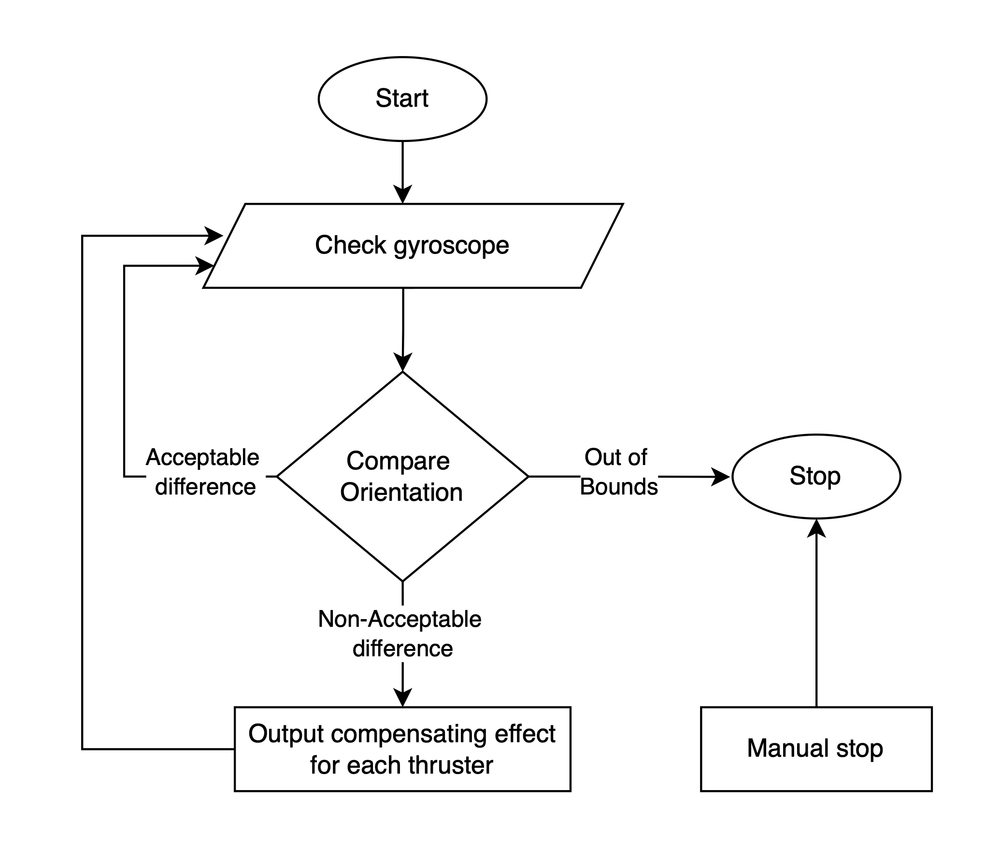
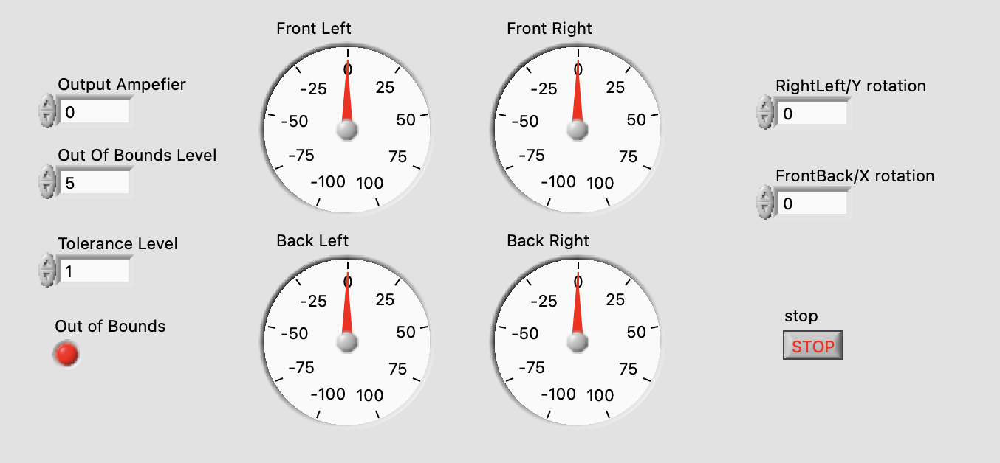
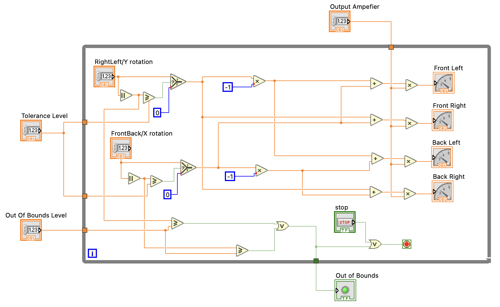

# Capjet-Orientation-Control-System Documentation

## Overview

The **Capjet-Orientation-Control-System** is designed to maintain the orientation of the ROV in a stable and stationary position underwater. The system uses a gyroscope to monitor the ROV’s rotational speeds in both the **RightLeft/Y** and **FrontBack/X** axes. Once activated, the system compensates for any unintentional movements by adjusting thrusters in real-time, ensuring that the ROV remains still, even when faced with external forces like water currents.

### Flowchart Representation

The following flowchart illustrates the logical flow of the **Capjet-Orientation-Control-System**:

1. The system starts by checking the gyroscope for any rotational movement.
2. If the detected rotation is within an acceptable range (based on the **Tolerance Level**), no action is taken.
3. If the rotation is beyond the acceptable range but still within safe limits, the system sends signals to the thrusters to correct the orientation.
4. If the detected rotation exceeds the **Out of Bounds** safety limits, the system stops automatically.
5. The system can also be stopped manually at any point.

---

## Inputs

- **Gyroscope Rotations**: These inputs measure how fast the ROV rotates in **degrees per second** using two axes:
  - **RightLeft/Y Rotation**: Measures the rotation from left to right along the Y-axis.
  - **FrontBack/X Rotation**: Measures the rotation from front to back along the X-axis.

For testing purposes, you can manually input values to simulate gyroscope readings for the X and Y axes. This helps observe how the system responds to different rotation speeds without needing an actual gyroscope.

## Outputs

- **Thruster Signals**: The system generates four output signals, each controlling one of the ROV’s thrusters:
  - Front Left Thruster.
  - Front Right Thruster.
  - Back Left Thruster.
  - Back Right Thruster.

These signals are shown on the front panel as Thruster Gauges, reflecting the real-time adjustments based on the gyroscope data. The signals connect to the thrusters to provide corrective actions and stabilize the ROV.

### Threshold Parameters

- **Tolerance Level**: This setting allows the system to ignore small rotations caused by natural noise or sensor inaccuracies.
- **Out of Bounds Level**: This sets the highest allowable rotational speed. If the rotation speed exceeds this limit, the system shuts down the **Orientation-Control-System** to prevent damage or instability. 
- **Output Amplifier**: This amplifies signals sent to the thrusters, allowing the system to control how much power is applied to each thruster based on the detected rotation.

---

## Front Panel Elements

The following image shows the LabVIEW Front Panel for controlling the system:

### Controls

- **RightLeft/Y Rotation** and **FrontBack/X Rotation**: These numeric inputs measure the ROV’s rotational speed in degrees per second. The values come from the gyroscope or can be entered manually for testing.

- **Tolerance Level**: This variable setting defines the threshold below which the system will not make any thruster adjustments. If the rotation is below this value, no adjustments are made to the thrusters, allowing the system to ignore minor, insignificant movements.

- **Out of Bounds Level**: This variable setting defines the maximum allowable rotation speed. If the ROV's rotation exceeds this limit, the **Orientation-Control-System** automatically shuts down to prevent damage. This setting is intended to handle extreme situations or malfunctions.

- **Output Amplifier**: This setting controls how much power is sent to the thrusters. It increases the thruster response based on how much rotation is detected, helping to fine-tune the ROV's movement. 

### Indicators

- **Thruster Gauges**: These gauges (Front Left, Front Right, Back Left, Back Right) display the power being applied to each thruster. They adjust in real time based on the rotation data and the amplifier settings.
- **Out of Bounds Indicator**: A light that turns on when the ROV’s rotational speed exceeds the **Out of Bounds** safety limit.
- **Stop Button**:  A button that allows the operator to stop the system manually at any time.

---

## Block Diagram Breakdown

The following image shows the Block Diagram in LabVIEW for the system's logic:

### Input Processing

- The system processes the **RightLeft/Y Rotation** and **FrontBack/X Rotation** values by comparing them to the **Tolerance Level**. If the rotations are above the tolerance level, The system activates the thrusters to correct the rotation.

### Compensation Logic

- For both the X and Y axes:
  - If the rotation exceeds the tolerance level, the system sends correction signals to the appropriate thrusters to reduce the rotation.
  - The **Output Amplifier** controls how strong these signals are, adjusting the power of the thrusters based on the amount of rotation detected.
  - **Multipliers** adjust the compensation applied to each thruster (Front Left, Front Right, Back Left, and Back Right) to return the ROV to a stable position.

### Out of Bounds Detection

- If the rotational speed exceeds the **Out of Bounds Level**, the system will:
  - Light up the **Out of Bounds Indicator**.
  - Automatically stop the system to prevent instability.

### Stop Logic

- The **Stop Button** allows the operator to stop the system at any time. The button works through an OR gate, ensuring the system stops either manually or when the rotation exceeds the **Out of Bounds** safety limit.