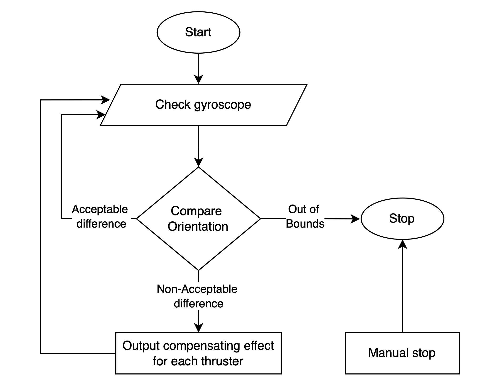

# Capjet-Orientation-Control-System Documentation

> [!IMPORTANT]
> This is a short summary of the functions. For a more in-depth explanation, check out [README-LONG](./README-LONG.md).

## Overview

The **Capjet-Orientation-Control-System** stabilizes the ROV underwater by monitoring its rotation with a gyroscope. It adjusts thrusters in real-time to correct unintended movements caused by external forces like currents.

### Flowchart

The system operates as follows:

1. Checks gyroscope for rotational movement.
2. If within **Tolerance Level**, no action is taken.
3. If rotation exceeds tolerance but is safe, adjusts thrusters.
4. If rotation exceeds **Out of Bounds** level, system shuts down automatically.
5. Manual stop is always available.

---

## Inputs

- **Gyroscope Rotations**: Measures rotation in **degrees per second**:
  - **RightLeft/Y Rotation**: Left-to-right rotation along the Y-axis.
  - **FrontBack/X Rotation**: Front-to-back rotation along the X-axis.

For testing, you can manually input rotation values.

## Outputs

- **Thruster Signals**: Four output signals control:
  - Front Left, Front Right, Back Left, and Back Right thrusters.

These signals are shown on Thruster Gauges on the front panel and adjust in real-time.

### Threshold Parameters

- **Tolerance Level**: Threshold for ignoring minor rotations.
- **Out of Bounds Level**: Maximum allowable rotation speed. Exceeding this shuts down the system.
- **Output Amplifier**: Controls the power sent to the thrusters based on detected rotation.

---

## Front Panel Elements

### Controls

- **Rotation Inputs**: Measure rotation from gyroscope or can be manually entered for testing.
- **Tolerance Level**: Ignores small rotations below this threshold.
- **Out of Bounds Level**: Maximum safe rotation speed; system shuts down if exceeded.
- **Output Amplifier**: Adjusts thruster power for precise control.

### Indicators

- **Thruster Gauges**: Display real-time power applied to each thruster.
- **Out of Bounds Indicator**: Lights up if rotation speed is unsafe.
- **Stop Button**: Allows manual stopping of the system.

---

## Block Diagram Breakdown

### Input Processing

- Compares Y and X axis rotations to the **Tolerance Level**. Activates thrusters if the rotation exceeds this value.

### Compensation Logic

- Sends correction signals to thrusters if rotation is above tolerance.
- **Output Amplifier** adjusts signal strength and thruster power.
- **Multipliers** ensure proper compensation to stabilize the ROV.

### Out of Bounds Detection

- Activates **Out of Bounds Indicator** and shuts down the system if rotation exceeds the **Out of Bounds Level**.

### Stop Logic

- **Stop Button** stops the system manually or when the **Out of Bounds** condition occurs.